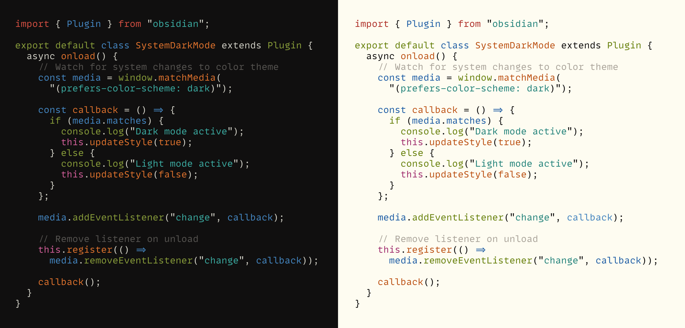

Flexoki is an inky color scheme for prose and code. Flexoki is designed for reading and writing on digital screens. It is inspired by analog printing inks and warm shades of paper.

Learn more at [stephango.com/flexoki](https://stephango.com/flexoki)

## Syntax highlighting

## Base tones

| Value | Hex       | RGB             |
| ----- | --------- | --------------- |
| black | `#100F0F` | `16, 15, 15`    |
| 950   | `#1C1B1A` | `28, 27, 26`    |
| 900   | `#282726` | `40, 39, 38`    |
| 850   | `#343331` | `52, 51, 49`    |
| 800   | `#403E3C` | `64, 62, 60`    |
| 700   | `#575653` | `87, 86, 83`    |
| 600   | `#6F6E69` | `111, 110, 105` |
| 500   | `#878580` | `135, 133, 128` |
| 300   | `#B7B5AC` | `183, 181, 172` |
| 200   | `#CECDC3` | `206, 205, 195` |
| 150   | `#DAD8CE` | `218, 216, 206` |
| 100   | `#E6E4D9` | `230, 228, 217` |
| 50    | `#F2F0E5` | `242, 240, 229` |
| paper | `#FFFCF0` | `255, 252, 240` |

## Colors

### Dark tones

| Color   | Hex       | RGB    |
| ------- | --------- | -------------- |
| red     | `#AF3029` | `175, 48, 41`  |
| orange  | `#BC5215` | `188, 82, 21`  |
| yellow  | `#AD8301` | `173, 131, 1`  |
| green   | `#66800B` | `102, 128, 11` |
| cyan    | `#24837B` | `36, 131, 123` |
| blue    | `#205EA6` | `32, 94, 166`  |
| purple  | `#5E409D` | `94, 64, 157`  |
| magenta | `#A02F6F` | `160, 47, 111` |

### Light tones

| Color   | Hex       | RGB     |
| ------- | --------- | --------------- |
| red     | `#D14D41` | `209, 77, 65`   |
| orange  | `#DA702C` | `218, 112, 44`  |
| yellow  | `#D0A215` | `208, 162, 21`  |
| green   | `#879A39` | `135, 154, 57`  |
| cyan    | `#3AA99F` | `58, 169, 159`  |
| blue    | `#4385BE` | `67, 133, 190`  |
| purple  | `#8B7EC8` | `139, 126, 200` |
| magenta | `#CE5D97` | `206, 93, 151`  |

## Ports

Flexoki is available for the following apps and tools

### Apps

- [Obsidian theme](https://github.com/kepano/flexoki-obsidian) and part of [Minimal theme](https://github.com/kepano/obsidian-minimal) by @kepano
- [iTerm2](https://github.com/kepano/flexoki/tree/main/iterm2) thanks to @techvlad
- [Neovim](https://github.com/kepano/flexoki/tree/main/neovim) by @stevedylandev
- [macOS Terminal](https://github.com/kepano/flexoki/tree/main/terminal) by @getninjaN
- [Windows Terminal](https://github.com/kepano/flexoki/tree/main/windows-terminal) by 2joukevandermaas

### Frameworks

- [Shadcn](https://gist.github.com/phenomen/affd8c346538378548febd20dccdbfcc) by phenomen
- [Tailwind](https://gist.github.com/martin-mael/4b50fa8e55da846f3f73399d84fa1848) by martin-mael

## Other

- [GIMP palette](https://github.com/kepano/flexoki/tree/main/gimp) by @xTibor

## Contributing

Flexoki is MIT licensed. You are free to port Flexoki to any app. Please include attribution and a link to [stephango.com/flexoki](https://stephango.com/flexoki) and add a link to your port in the list above via pull request.
