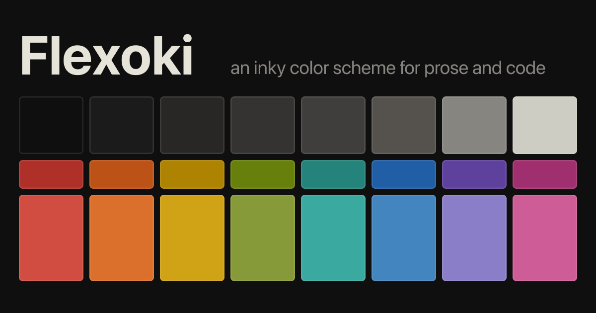
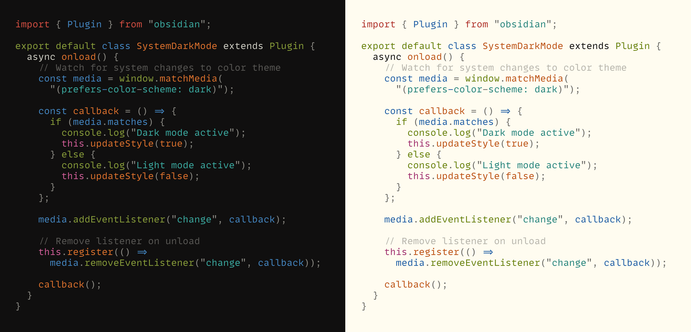
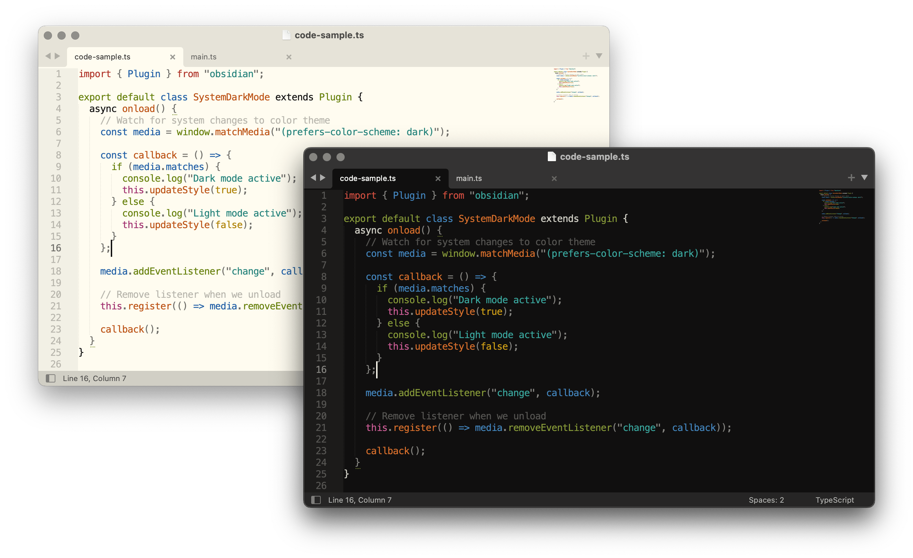
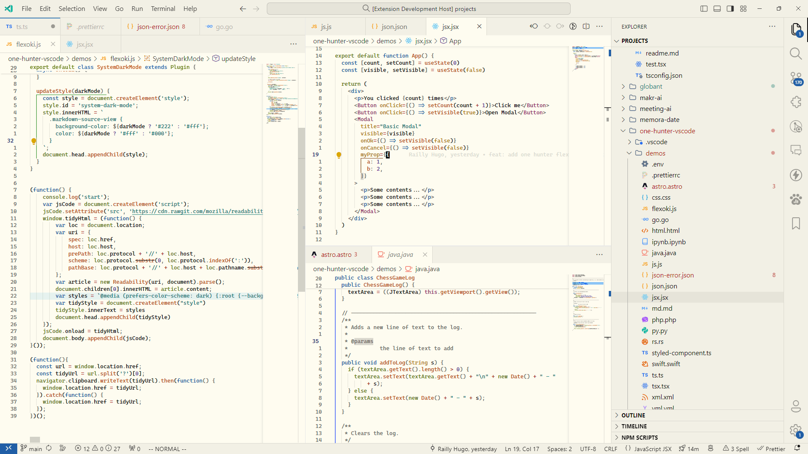

Flexoki is an inky color scheme for prose and code. Flexoki is designed for reading and writing on digital screens. It is inspired by analog printing inks and warm shades of paper.

Learn more at [stephango.com/flexoki](https://stephango.com/flexoki)

## Syntax highlighting

## Ports

Flexoki is available for the following apps and tools.

### Apps

- [Alacritty](https://github.com/kepano/flexoki/tree/main/alacritty) by @willtheodore
- [Discord](https://github.com/kepano/flexoki/discord) by @thatoddshade using [Discord Recolor](https://github.com/mwittrien/BetterDiscordAddons/tree/master/Themes/DiscordRecolor)
- [Emacs](https://github.com/crmsnbleyd/flexoki-emacs-theme) by @crmsnbleyd
- [Firefox](https://github.com/ddogfoodd/firefox-flexoki-dynamic-theme) by @ddogfoodd
- [fish](https://github.com/kepano/flexoki/tree/main/fish) by @Orest58008
- [IntelliJ](https://github.com/kepano/flexoki/tree/main/intellij) by @annoyingmouse
- [iTerm2](https://github.com/kepano/flexoki/tree/main/iterm2) by @techvlad and @pingiun
- [Kitty](https://github.com/kepano/flexoki/tree/main/kitty) by @peterjbachman
- [Lite XL](https://github.com/kepano/flexoki/tree/main/lite_xl) by @chambored
- [macOS Terminal](https://github.com/kepano/flexoki/tree/main/terminal) by @getninjaN
- [Neovim](https://github.com/kepano/flexoki-neovim) by @stevedylandev and @dinocosta
- [Obsidian](https://github.com/kepano/flexoki-obsidian) and part of [Minimal theme](https://github.com/kepano/obsidian-minimal) by @kepano
- [Slack](https://github.com/kepano/flexoki/tree/main/slack) by @maxobat
- [Standard Notes](https://github.com/myreli/sn-flexoki) by @myreli
- [Sublime Text](https://github.com/kepano/flexoki-sublime) by @kepano
- [Tape](https://github.com/kepano/flexoki/tree/main/tape) by @TheLastZombie
- [Tealdeer](https://github.com/kepano/flexoki/tree/main/tealdeer) by @Orest58008
- [tmux](https://github.com/kepano/flexoki/tree/main/tmux) by @tklai
- [Ulysses](https://github.com/kepano/flexoki/tree/main/ulysses) by @jasonekratz
- [Visual Studio Code](https://github.com/kepano/flexoki/tree/main/vscode) by @Railly
- [Warp](https://github.com/kepano/flexoki/tree/main/warp-terminal) by @tplesnar
- [Waybar](https://github.com/kepano/flexoki/tree/main/waybar) by @Orest58008
- [WezTerm](https://github.com/kepano/flexoki/tree/main/wezterm) by @jbromley
- [Windows Terminal](https://github.com/kepano/flexoki/tree/main/windows-terminal) by @joukevandermaas
- [Xresources](https://github.com/kepano/flexoki/tree/main/xresources) by @dmb2

### System themes
- [gtk](https://github.com/kepano/flexoki/tree/main/gtk) by @hydroakri
- [qt5ct/qt6ct](https://github.com/kepano/flexoki/tree/main/qt6ct) by @hydroakri

### Frameworks

- [Shadcn](https://gist.github.com/phenomen/affd8c346538378548febd20dccdbfcc) by @phenomen
- [Tailwind](https://gist.github.com/martin-mael/4b50fa8e55da846f3f73399d84fa1848) by @martin-mael
- [theme.sh](https://github.com/kepano/flexoki/tree/main/theme.sh) by @TheLastZombie
- [pywal](https://github.com/kepano/flexoki/tree/main/pywal) by @hydroakri

### Other

- [Figma](https://www.figma.com/community/file/1293274371462921490/flexoki) by @kepano
- [GIMP palette](https://github.com/kepano/flexoki/tree/main/gimp) by @xTibor

## Contributing

Flexoki is MIT licensed. You are free to port Flexoki to any app. Please include attribution and a link to [stephango.com/flexoki](https://stephango.com/flexoki). Add a link to your port in the list above via pull request.

## Screenshots

#### Sublime Text

#### VS Code

## Colors

Please [see documentation](https://stephango.com/flexoki) for how to apply these colors.

### Base tones

| Value | Hex       | RGB             |
| ----- | --------- | --------------- |
| black | `#100F0F` | `16, 15, 15`    |
| 950   | `#1C1B1A` | `28, 27, 26`    |
| 900   | `#282726` | `40, 39, 38`    |
| 850   | `#343331` | `52, 51, 49`    |
| 800   | `#403E3C` | `64, 62, 60`    |
| 700   | `#575653` | `87, 86, 83`    |
| 600   | `#6F6E69` | `111, 110, 105` |
| 500   | `#878580` | `135, 133, 128` |
| 300   | `#B7B5AC` | `183, 181, 172` |
| 200   | `#CECDC3` | `206, 205, 195` |
| 150   | `#DAD8CE` | `218, 216, 206` |
| 100   | `#E6E4D9` | `230, 228, 217` |
| 50    | `#F2F0E5` | `242, 240, 229` |
| paper | `#FFFCF0` | `255, 252, 240` |

### Dark colors

| Color   | Hex       | RGB            |
| ------- | --------- | -------------- |
| red     | `#AF3029` | `175, 48, 41`  |
| orange  | `#BC5215` | `188, 82, 21`  |
| yellow  | `#AD8301` | `173, 131, 1`  |
| green   | `#66800B` | `102, 128, 11` |
| cyan    | `#24837B` | `36, 131, 123` |
| blue    | `#205EA6` | `32, 94, 166`  |
| purple  | `#5E409D` | `94, 64, 157`  |
| magenta | `#A02F6F` | `160, 47, 111` |

### Light colors

| Color   | Hex       | RGB             |
| ------- | --------- | --------------- |
| red     | `#D14D41` | `209, 77, 65`   |
| orange  | `#DA702C` | `218, 112, 44`  |
| yellow  | `#D0A215` | `208, 162, 21`  |
| green   | `#879A39` | `135, 154, 57`  |
| cyan    | `#3AA99F` | `58, 169, 159`  |
| blue    | `#4385BE` | `67, 133, 190`  |
| purple  | `#8B7EC8` | `139, 126, 200` |
| magenta | `#CE5D97` | `206, 93, 151`  |
