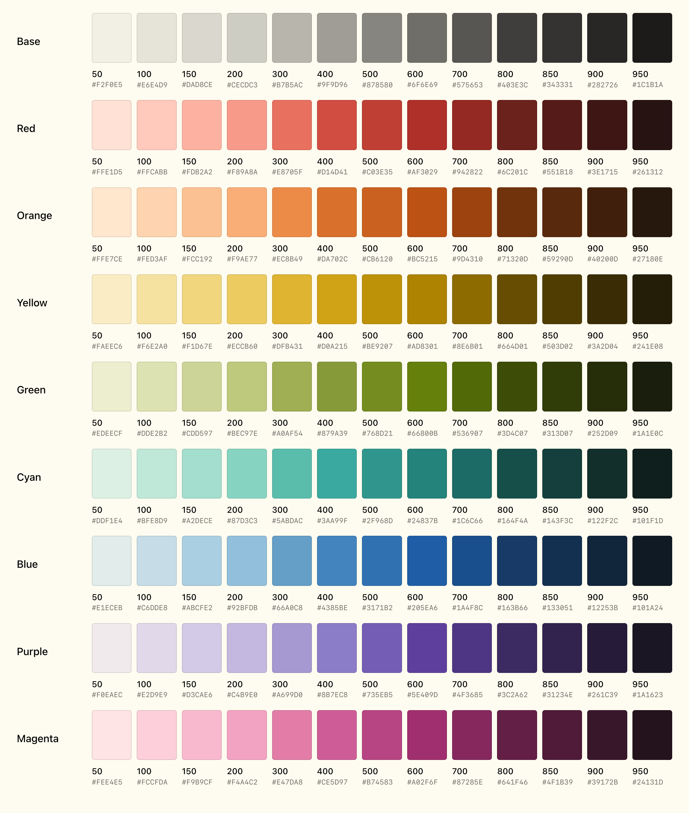

Flexoki is an inky color scheme for prose and code. Flexoki is designed for reading and writing on digital screens. It is inspired by analog printing inks and warm shades of paper.

Learn more at [stephango.com/flexoki](https://stephango.com/flexoki)

## Syntax highlighting

## Ports

Flexoki is available for the following apps and tools.

### Apps

- [Alacritty](https://github.com/kepano/flexoki/tree/main/alacritty) by @willtheodore
- [Chrome](https://github.com/kepano/flexoki/tree/main/chrome) by @FormalSnake
- [Discord](https://github.com/kepano/flexoki/tree/main/discord) by @thatoddshade using [Discord Recolor](https://github.com/mwittrien/BetterDiscordAddons/tree/master/Themes/DiscordRecolor)
- [Drafts](https://github.com/kepano/flexoki/tree/main/drafts) by @jihad
- [Emacs](https://github.com/crmsnbleyd/flexoki-emacs-theme) by @crmsnbleyd
- [Firefox](https://codeberg.org/ddogfoodd/firefox-flexoki-dynamic-theme) by @ddogfoodd
- [fish](https://github.com/kepano/flexoki/tree/main/fish) by @Orest58008
- Ghostty (built-in)
- [Helix](https://github.com/kepano/flexoki/tree/main/helix) by @apcamargo
- [IntelliJ](https://github.com/kepano/flexoki/tree/main/intellij) by @annoyingmouse
- [iTerm2](https://github.com/kepano/flexoki/tree/main/iterm2) by @techvlad and @pingiun
- [Kitty](https://github.com/kepano/flexoki/tree/main/kitty) by @peterjbachman
- [Lite XL](https://github.com/kepano/flexoki/tree/main/lite_xl) by @chambored
- [macOS Terminal](https://github.com/kepano/flexoki/tree/main/terminal) by @getninjaN
- Neovim:
  - [@katepolak and @dinocosta](https://github.com/kepano/flexoki-neovim)
  - [@cpplain](https://github.com/cpplain/flexoki.nvim)
  - [@nuvic](https://github.com/nuvic/flexoki-nvim)
- [NetNewsWire](https://github.com/frznv/NetNewsWire-Flexoki) by @frznv
- [Obsidian](https://github.com/kepano/flexoki-obsidian) and part of [Minimal theme](https://github.com/kepano/obsidian-minimal) by @kepano
- [Slack](https://github.com/kepano/flexoki/tree/main/slack) by @maxobat
- [Standard Notes](https://github.com/myreli/sn-flexoki) by @myreli
- [Sublime Text](https://github.com/kepano/flexoki-sublime) by @kepano
- [Tape](https://github.com/kepano/flexoki/tree/main/tape) by @TheLastZombie
- [Tealdeer](https://github.com/kepano/flexoki/tree/main/tealdeer) by @Orest58008
- [Telegram](https://github.com/kepano/flexoki/tree/main/telegram) by @Orest58008
- [tmux](https://github.com/kepano/flexoki/tree/main/tmux) by @tklai
- [Ulysses](https://github.com/kepano/flexoki/tree/main/ulysses) by @jasonekratz
- [Visual Studio Code](https://github.com/kepano/flexoki/tree/main/vscode) by @Railly
- [Warp](https://github.com/kepano/flexoki/tree/main/warp-terminal) by @tplesnar
- [Waybar](https://github.com/kepano/flexoki/tree/main/waybar) by @Orest58008
- [WezTerm](https://github.com/kepano/flexoki/tree/main/wezterm) by @jbromley
- [Windows Terminal](https://github.com/kepano/flexoki/tree/main/windows-terminal) by @joukevandermaas
- [Xresources](https://github.com/kepano/flexoki/tree/main/xresources) by @dmb2
- [Yazi Dark](https://github.com/gosxrgxx/flexoki-dark.yazi), [Yazi Light](https://github.com/gosxrgxx/flexoki-light.yazi) by @gosxrgxx
- [Zed](https://github.com/kepano/flexoki/tree/main/zed) by @dinocosta
- [Zellij](https://github.com/kepano/flexoki/tree/main/zellij) by @jackplus-xyz

### System themes

- [gtk](https://github.com/kepano/flexoki/tree/main/gtk) by @hydroakri
- [qt5ct/qt6ct](https://github.com/kepano/flexoki/tree/main/qt6ct) by @hydroakri
- [KDE color](https://github.com/kepano/flexoki/tree/main/kde) by @hydroakri
- [Omarchy](https://github.com/euandeas/omarchy-flexoki-dark-theme) by @euandeas

### Frameworks

- [Shadcn](https://gist.github.com/phenomen/affd8c346538378548febd20dccdbfcc) by @phenomen
- [Tailwind](https://github.com/kepano/flexoki/tree/main/tailwind) by @bslobodin
- [theme.sh](https://github.com/kepano/flexoki/tree/main/theme.sh) by @TheLastZombie
- [pywal](https://github.com/kepano/flexoki/tree/main/pywal) by @hydroakri
- [Starlight](https://delucis.github.io/starlight-theme-flexoki/) by @delucis

### Other

- [Affinity palette](https://github.com/kepano/flexoki/tree/main/affinity) by @Spirou42
- [Clip Studio Paint](https://github.com/scottandrewlepera/flexoki-extended-csp) by @scottandrewlepera
- [Figma](https://www.figma.com/community/file/1293274371462921490/flexoki) by @kepano
- [GIMP palette](https://github.com/kepano/flexoki/tree/main/gimp) by @xTibor
- [Python/Matplotlib](https://github.com/kepano/flexoki/tree/main/python-matplotlib) by @moss-xyz
- [R](https://github.com/mdscheuerell/flexoki/) by @mdscheuerell
- [Wikipedia UserCSS](https://userstyles.world/style/17944/wikipedia-flexoki) (requires [Stylus](https://github.com/openstyles/stylus/#releases)) by @KraXen72

## Contributing

Flexoki is MIT licensed. You are free to port Flexoki to any app. Please include attribution and a link to [stephango.com/flexoki](https://stephango.com/flexoki). Add a link to your port in the list above via pull request.

## Screenshots

#### Sublime Text

#### VS Code

## Colors

Please [see documentation](https://stephango.com/flexoki) for how to apply these colors. The standard palette uses the base colors, and the 400/600 accent color values. The [extended palette](https://stephango.com/flexoki#extended-palette) adds a full range of values from 50-950 for UIs and more complex projects.

### Base

| Name         | Hex        | RGB             |
| ------------ | ---------- | --------------- |
| paper        | `#FFFCF0`  | `255, 252, 240` |
| base-50      | `#F2F0E5`  | `242, 240, 229` |
| base-100     | `#E6E4D9`  | `230, 228, 217` |
| base-150     | `#DAD8CE`  | `218, 216, 206` |
| base-200     | `#CECDC3`  | `206, 205, 195` |
| base-300     | `#B7B5AC`  | `183, 181, 172` |
| base-400     | `#9F9D96`  | `159, 157, 150` |
| base-500     | `#878580`  | `135, 133, 128` |
| base-600     | `#6F6E69`  | `111, 110, 105` |
| base-700     | `#575653`  | `87, 86, 83`    |
| base-800     | `#403E3C`  | `64, 62, 60`    |
| base-850     | `#343331`  | `52, 51, 49`    |
| base-900     | `#282726`  | `40, 39, 38`    |
| base-950     | `#1C1B1A`  | `28, 27, 26`    |
| black        | `#100F0F`  | `16, 15, 15`    |

### Dark colors

| Color       | Hex       | RGB            |
| ----------- | --------- | -------------- |
| red-600     | `#AF3029` | `175, 48, 41`  |
| orange-600  | `#BC5215` | `188, 82, 21`  |
| yellow-600  | `#AD8301` | `173, 131, 1`  |
| green-600   | `#66800B` | `102, 128, 11` |
| cyan-600    | `#24837B` | `36, 131, 123` |
| blue-600    | `#205EA6` | `32, 94, 166`  |
| purple-600  | `#5E409D` | `94, 64, 157`  |
| magenta-600 | `#A02F6F` | `160, 47, 111` |

### Light colors

| Color       | Hex       | RGB             |
| ----------- | --------- | --------------- |
| red-400     | `#D14D41` | `209, 77, 65`   |
| orange-400  | `#DA702C` | `218, 112, 44`  |
| yellow-400  | `#D0A215` | `208, 162, 21`  |
| green-400   | `#879A39` | `135, 154, 57`  |
| cyan-400    | `#3AA99F` | `58, 169, 159`  |
| blue-400    | `#4385BE` | `67, 133, 190`  |
| purple-400  | `#8B7EC8` | `139, 126, 200` |
| magenta-400 | `#CE5D97` | `206, 93, 151`  |

## Extended palette

If you wish to use Flexoki for more complex applications beyond syntax highlighting and basic color schemes, the extended palette includes a complete set of values for every accent color from 50 to 950.

### Red

| Name         | Hex        | RGB             |
| ------------ | ---------- | --------------- |
| red-50       | `#FFE1D5`  | `255, 225, 213` |
| red-100      | `#FFCABB`  | `255, 202, 187` |
| red-150      | `#FDB2A2`  | `253, 178, 162` |
| red-200      | `#F89A8A`  | `248, 154, 138` |
| red-300      | `#E8705F`  | `232, 112, 95`  |
| red-400      | `#D14D41`  | `209, 77, 65`   |
| red-500      | `#C03E35`  | `192, 62, 53`   |
| red-600      | `#AF3029`  | `175, 48, 41`   |
| red-700      | `#942822`  | `148, 40, 34`   |
| red-800      | `#6C201C`  | `108, 32, 28`   |
| red-850      | `#551B18`  | `85, 27, 24`    |
| red-900      | `#3E1715`  | `62, 23, 21`    |
| red-950      | `#261312`  | `38, 19, 18`    |

### Orange

| Name         | Hex        | RGB             |
| ------------ | ---------- | --------------- |
| orange-50    | `#FFE7CE`  | `255, 231, 206` |
| orange-100   | `#FED3AF`  | `254, 211, 175` |
| orange-150   | `#FCC192`  | `252, 193, 146` |
| orange-200   | `#F9AE77`  | `249, 174, 119` |
| orange-300   | `#EC8B49`  | `236, 139, 73`  |
| orange-400   | `#DA702C`  | `218, 112, 44`  |
| orange-500   | `#CB6120`  | `203, 97, 32`   |
| orange-600   | `#BC5215`  | `188, 82, 21`   |
| orange-700   | `#9D4310`  | `157, 67, 16`   |
| orange-800   | `#71320D`  | `113, 50, 13`   |
| orange-850   | `#59290D`  | `89, 41, 13`    |
| orange-900   | `#40200D`  | `64, 32, 13`    |
| orange-950   | `#27180E`  | `39, 24, 14`    |

### Yellow

| Name         | Hex        | RGB             |
| ------------ | ---------- | --------------- |
| yellow-50    | `#FAEEC6`  | `250, 238, 198` |
| yellow-100   | `#F6E2A0`  | `246, 226, 160` |
| yellow-150   | `#F1D67E`  | `241, 214, 126` |
| yellow-200   | `#ECCB60`  | `236, 203, 96`  |
| yellow-300   | `#DFB431`  | `223, 180, 49`  |
| yellow-400   | `#D0A215`  | `208, 162, 21`  |
| yellow-500   | `#BE9207`  | `190, 146, 7`   |
| yellow-600   | `#AD8301`  | `173, 131, 1`   |
| yellow-700   | `#8E6B01`  | `142, 107, 1`   |
| yellow-800   | `#664D01`  | `102, 77, 1`    |
| yellow-850   | `#503D02`  | `80, 61, 2`     |
| yellow-900   | `#3A2D04`  | `58, 45, 4`     |
| yellow-950   | `#241E08`  | `36, 30, 8`     |

### Green

| Name         | Hex        | RGB             |
| ------------ | ---------- | --------------- |
| green-50     | `#EDEECF`  | `237, 238, 207` |
| green-100    | `#DDE2B2`  | `221, 226, 178` |
| green-150    | `#CDD597`  | `205, 213, 151` |
| green-200    | `#BEC97E`  | `190, 201, 126` |
| green-300    | `#A0AF54`  | `160, 175, 84`  |
| green-400    | `#879A39`  | `135, 154, 57`  |
| green-500    | `#768D21`  | `118, 141, 33`  |
| green-600    | `#66800B`  | `102, 128, 11`  |
| green-700    | `#536907`  | `83, 105, 7`    |
| green-800    | `#3D4C07`  | `61, 76, 7`     |
| green-850    | `#313D07`  | `49, 61, 7`     |
| green-900    | `#252D09`  | `37, 45, 9`     |
| green-950    | `#1A1E0C`  | `26, 30, 12`    |

### Cyan

| Name         | Hex        | RGB             |
| ------------ | ---------- | --------------- |
| cyan-50      | `#DDF1E4`  | `221, 241, 228` |
| cyan-100     | `#BFE8D9`  | `191, 232, 217` |
| cyan-150     | `#A2DECE`  | `162, 222, 206` |
| cyan-200     | `#87D3C3`  | `135, 211, 195` |
| cyan-300     | `#5ABDAC`  | `90, 189, 172`  |
| cyan-400     | `#3AA99F`  | `58, 169, 159`  |
| cyan-500     | `#2F968D`  | `47, 150, 141`  |
| cyan-600     | `#24837B`  | `36, 131, 123`  |
| cyan-700     | `#1C6C66`  | `28, 108, 102`  |
| cyan-800     | `#164F4A`  | `22, 79, 74`    |
| cyan-850     | `#143F3C`  | `20, 63, 60`    |
| cyan-900     | `#122F2C`  | `18, 47, 44`    |
| cyan-950     | `#101F1D`  | `16, 31, 29`    |

### Blue

| Name         | Hex        | RGB             |
| ------------ | ---------- | --------------- |
| blue-50      | `#E1ECEB`  | `225, 236, 235` |
| blue-100     | `#C6DDE8`  | `198, 221, 232` |
| blue-150     | `#ABCFE2`  | `171, 207, 226` |
| blue-200     | `#92BFDB`  | `146, 191, 219` |
| blue-300     | `#66A0C8`  | `102, 160, 200` |
| blue-400     | `#4385BE`  | `67, 133, 190`  |
| blue-500     | `#3171B2`  | `49, 113, 178`  |
| blue-600     | `#205EA6`  | `32, 94, 166`   |
| blue-700     | `#1A4F8C`  | `26, 79, 140`   |
| blue-800     | `#163B66`  | `22, 59, 102`   |
| blue-850     | `#133051`  | `19, 48, 81`    |
| blue-900     | `#12253B`  | `18, 37, 59`    |
| blue-950     | `#101A24`  | `16, 26, 36`    |

### Purple

| Name         | Hex        | RGB             |
| ------------ | ---------- | --------------- |
| purple-50    | `#F0EAEC`  | `240, 234, 236` |
| purple-100   | `#E2D9E9`  | `226, 217, 233` |
| purple-150   | `#D3CAE6`  | `211, 202, 230` |
| purple-200   | `#C4B9E0`  | `196, 185, 224` |
| purple-300   | `#A699D0`  | `166, 153, 208` |
| purple-400   | `#8B7EC8`  | `139, 126, 200` |
| purple-500   | `#735EB5`  | `115, 94, 181`  |
| purple-600   | `#5E409D`  | `94, 64, 157`   |
| purple-700   | `#4F3685`  | `79, 54, 133`   |
| purple-800   | `#3C2A62`  | `60, 42, 98`    |
| purple-850   | `#31234E`  | `49, 35, 78`    |
| purple-900   | `#261C39`  | `38, 28, 57`    |
| purple-950   | `#1A1623`  | `26, 22, 35`    |

### Magenta

| Name         | Hex        | RGB             |
| ------------ | ---------- | --------------- |
| magenta-50   | `#FEE4E5`  | `254, 228, 229` |
| magenta-100  | `#FCCFDA`  | `252, 207, 218` |
| magenta-150  | `#F9B9CF`  | `249, 185, 207` |
| magenta-200  | `#F4A4C2`  | `244, 164, 194` |
| magenta-300  | `#E47DA8`  | `228, 125, 168` |
| magenta-400  | `#CE5D97`  | `206, 93, 151`  |
| magenta-500  | `#B74583`  | `183, 69, 131`  |
| magenta-600  | `#A02F6F`  | `160, 47, 111`  |
| magenta-700  | `#87285E`  | `135, 40, 94`   |
| magenta-800  | `#641F46`  | `100, 31, 70`   |
| magenta-850  | `#4F1B39`  | `79, 27, 57`    |
| magenta-900  | `#39172B`  | `57, 23, 43`    |
| magenta-950  | `#24131D`  | `36, 19, 29`    |
