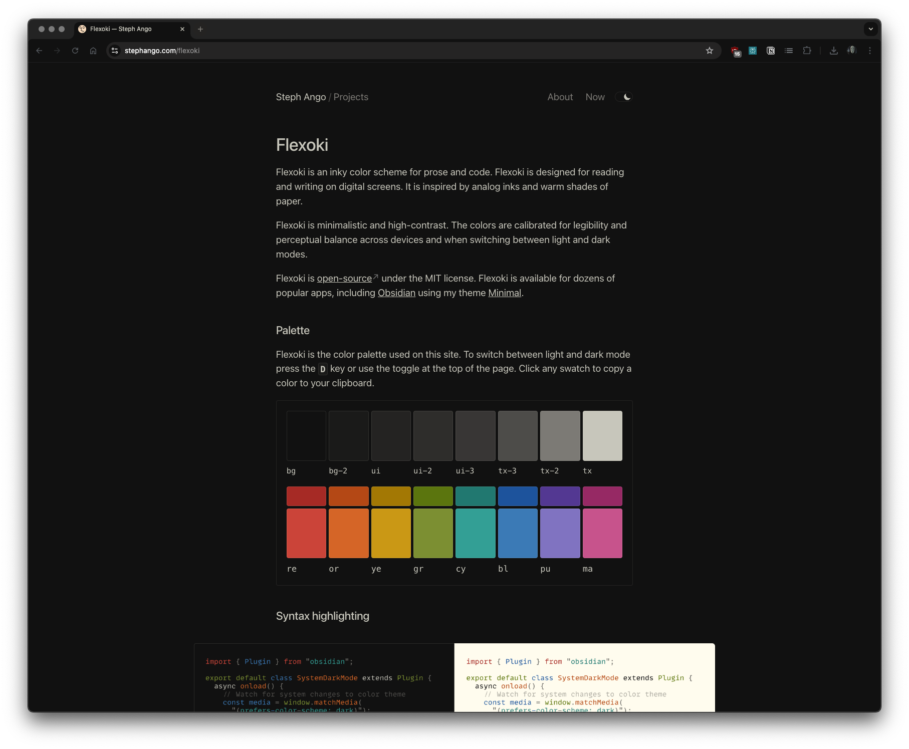

# Flexoki Chrome Theme
A Chrome theme based on Flexoki.

## Installation
1. Download the zipped theme in this directory.
2. Open Chrome and go to `chrome://extensions`.
3. Enable "Developer mode" in the top right corner.
4. Click "Load unpacked" and select the theme directory.

## Screenshots

