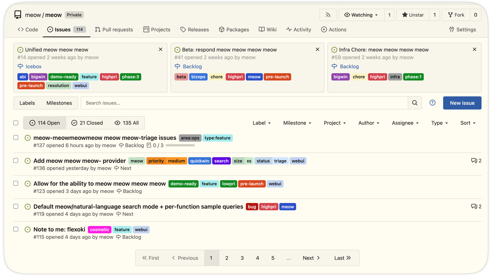
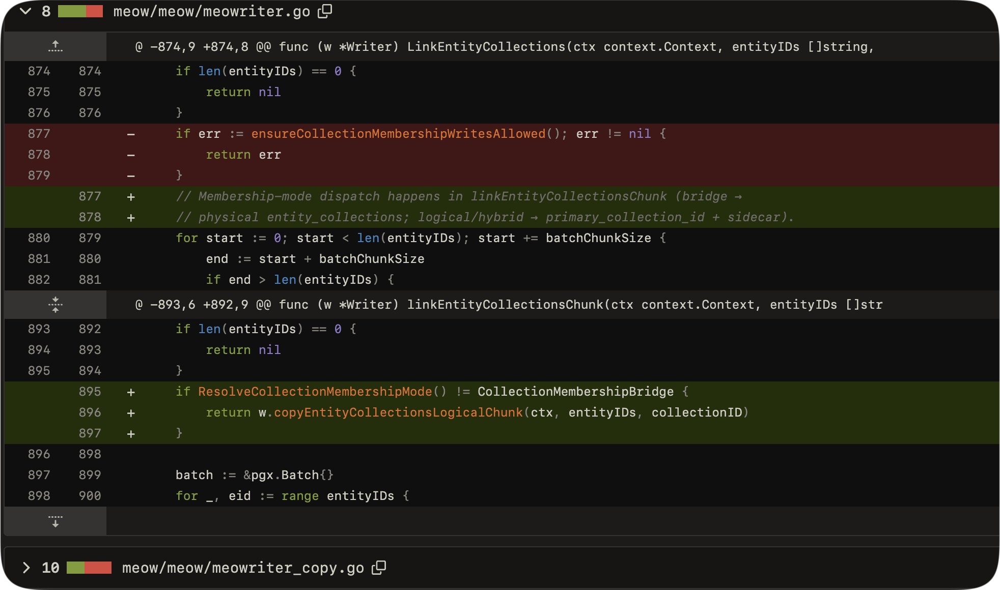
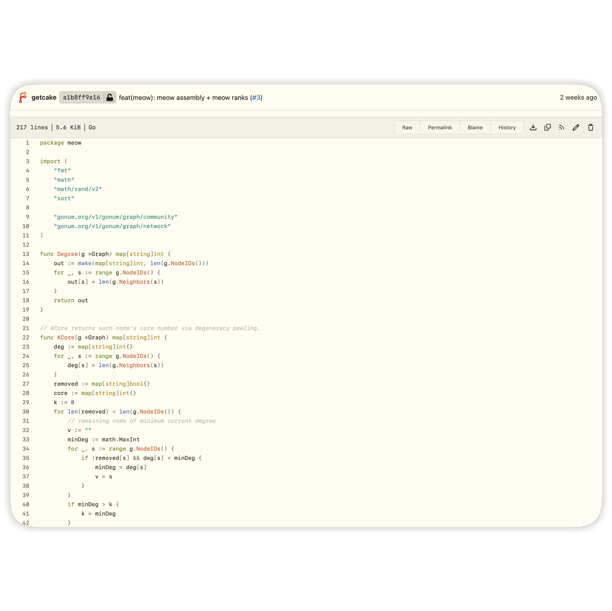
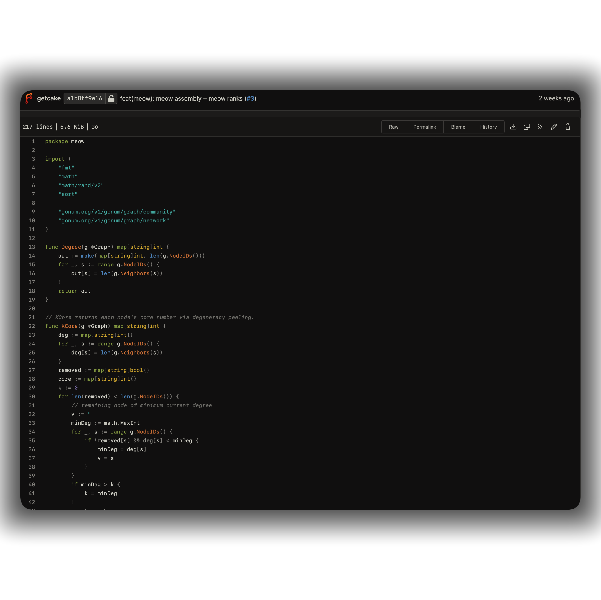

# flexoki for forgejo  
 

>[!NOTE]
>three variants are included:   
>- `flexoki-dark` — black/base-950 surfaces, 400-series accents  
>- `flexoki-light` — paper/base-50 surfaces, 600-series accents  
>- `flexoki-auto` — follows the os `prefers-color-scheme`  
  
---

## installation  
  

tested against forgejo v7.0+ (any version using css variable theming).  

  
1. copy the theme files into your custom directory (create it if needed):  

   ```sh  
   # bare metal (adjust to your custompath, see site administration -> configuration)  
   mkdir -p /var/lib/forgejo/custom/public/assets/css   cp css/theme-flexoki-*.css /var/lib/forgejo/custom/public/assets/css/  
   # docker: the custom dir lives under the data mount   cp css/theme-flexoki-*.css <data>/gitea/public/assets/css/  
   ```  

2. register the themes in `app.ini` (or the equivalent `forgejo__ui__*` environment variables):  

   ```ini  
   [ui]  
   themes = forgejo-auto,forgejo-light,forgejo-dark,flexoki-auto,flexoki-light,flexoki-dark   ;default_theme = flexoki-dark  
   ```  

3. restart forgejo, then pick the theme under **settings → appearance**.  

---

## screenshots  
  



  
  

---
  
## attribution & license  
  

MIT, same as flexoki. colors and design by [steph ango](https://stephango.com/flexoki) — per the flexoki contribution guidelines, this port includes attribution and a link to <https://stephango.com/flexoki>.  

---
