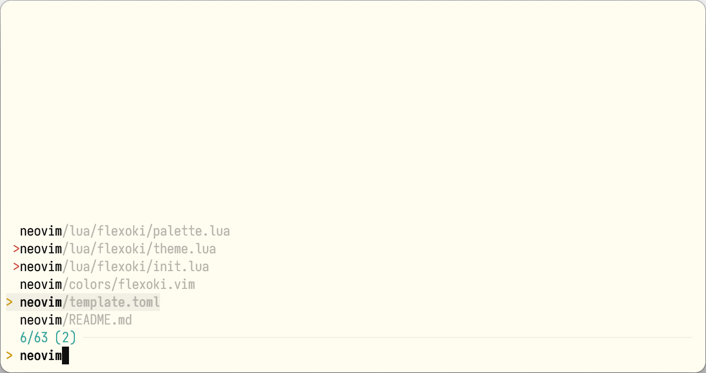
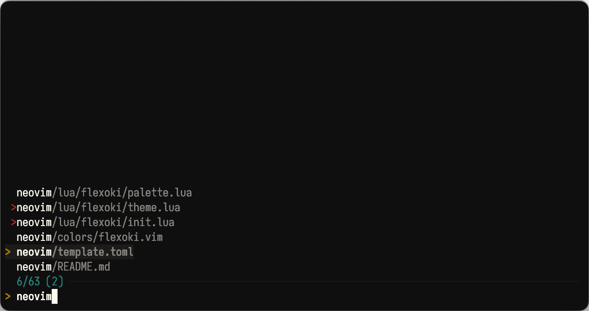

<p align="center">
	<h1 align="center">Flexofi for FZF</h2>
</p>

<p align="center">An inky color scheme for prose and code.</p>

## Light



* Bash/ZSH:

	```shell
	export FZF_DEFAULT_OPTS="
		--color=fg:#B7B5AC,bg:#FFFCF0,hl:#100F0F
		--color=fg+:#B7B5AC,bg+:#F2F0E5,hl+:#100F0F
		--color=border:#AF3029,header:#100F0F,gutter:#FFFCF0
		--color=spinner:#3AA99F,info:#3AA99F,separator:#F2F0E5
		--color=pointer:#D0A215,marker:#D14D41,prompt:#D0A215"
	```
* Fish:
 
	```shell
	set -Ux FZF_DEFAULT_OPTS '
		--color=fg:#B7B5AC,bg:#FFFCF0,hl:#100F0F
		--color=fg+:#B7B5AC,bg+:#F2F0E5,hl+:#100F0F
		--color=border:#AF3029,header:#100F0F,gutter:#FFFCF0
		--color=spinner:#3AA99F,info:#3AA99F,separator:#F2F0E5
		--color=pointer:#D0A215,marker:#D14D41,prompt:#D0A215"
	```

## Dark



* Bash/ZSH:

	```shell
	export FZF_DEFAULT_OPTS="
   		--color=fg:#878580,bg:#100F0F,hl:#CECDC3
   		--color=fg+:#878580,bg+:#1C1B1A,hl+:#CECDC3
   		--color=border:#AF3029,header:#CECDC3,gutter:#100F0F
   		--color=spinner:#24837B,info:#24837B,separator:#1C1B1A
   		--color=pointer:#AD8301,marker:#AF3029,prompt:#AD8301"
	```

 * Fish:

	```shell
  	set -Ux FZF_DEFAULT_OPTS '
		--color=fg:#878580,bg:#100F0F,hl:#CECDC3
		--color=fg+:#878580,bg+:#1C1B1A,hl+:#CECDC3
		--color=border:#AF3029,header:#CECDC3,gutter:#100F0F
		--color=spinner:#24837B,info:#24837B,separator:#282726
		--color=pointer:#AD8301,marker:#AF3029,prompt:#AD8301'
	```
