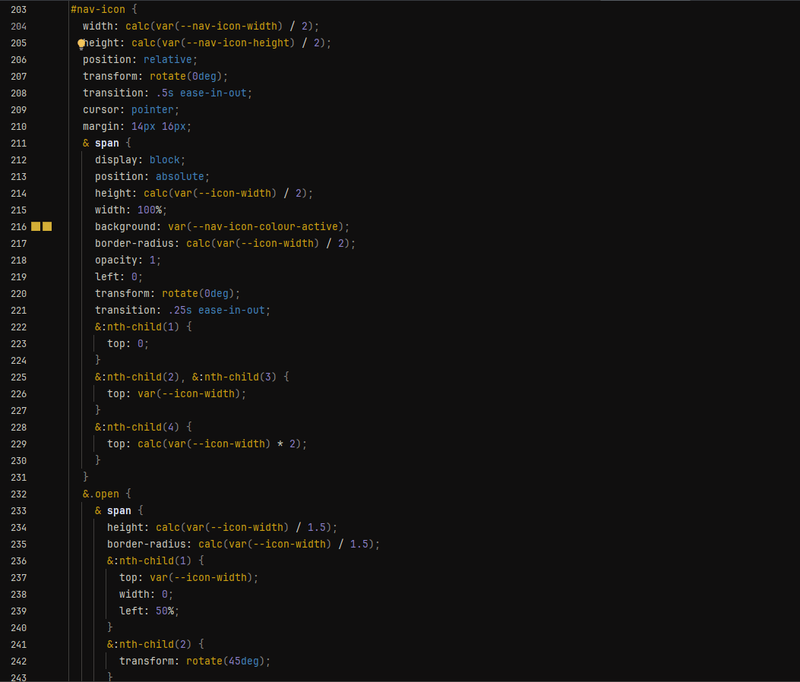
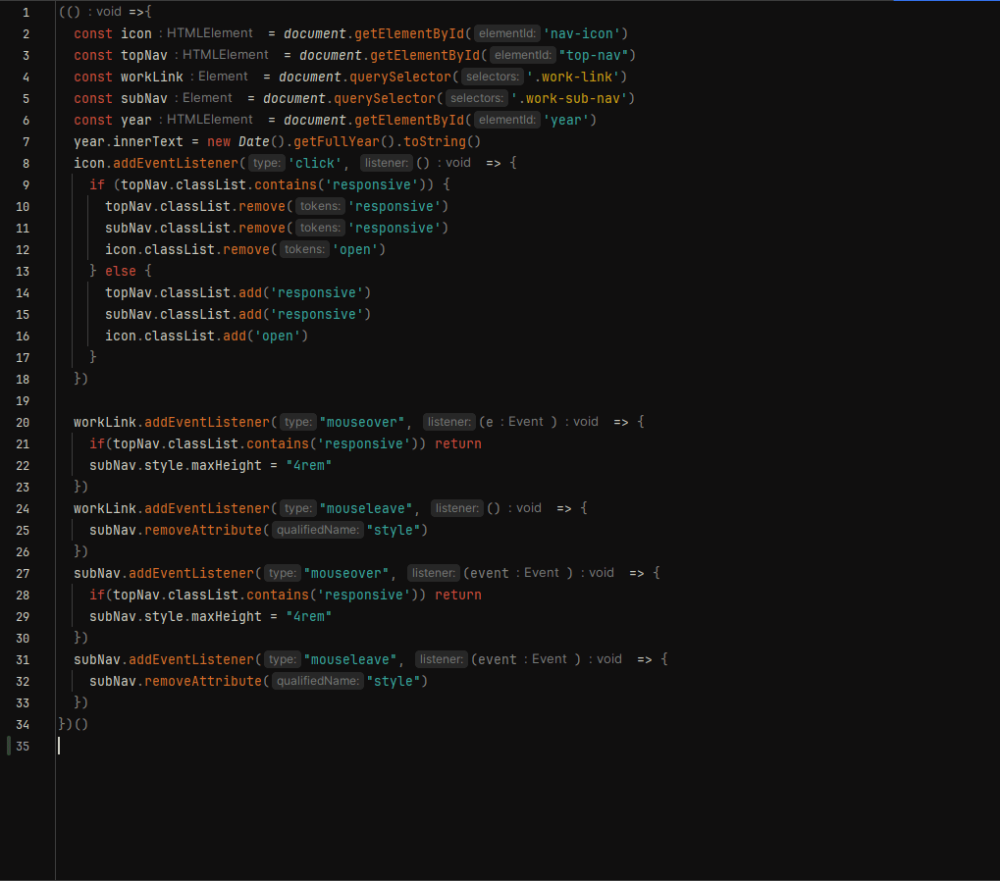
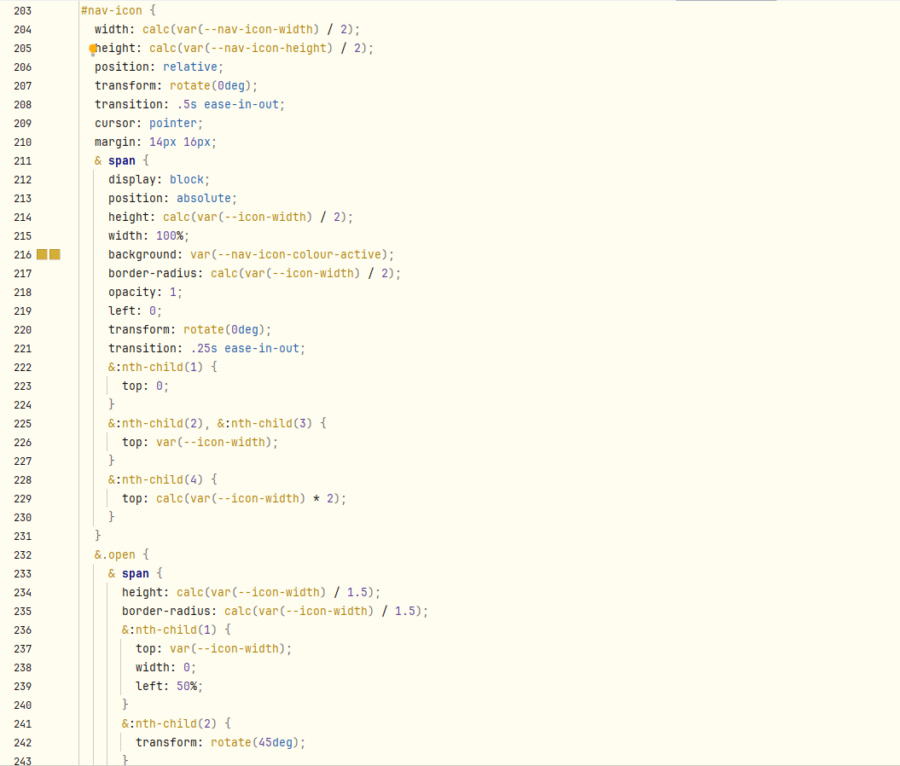
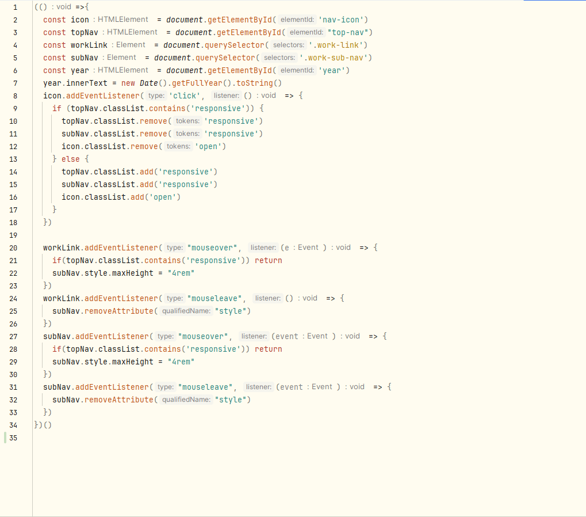

# Flexoki for IntelliJ and Jetbrains IDEs

## Flexoki Dark

## Flexoki Light

## How to install:

1. Press `Ctl` `Alt` `S` to open the IDE settings and then select **Editor | Color Scheme**.
2. From the #Scheme# list, select a color scheme, then click the cog icon, the click **Import Scheme**.

