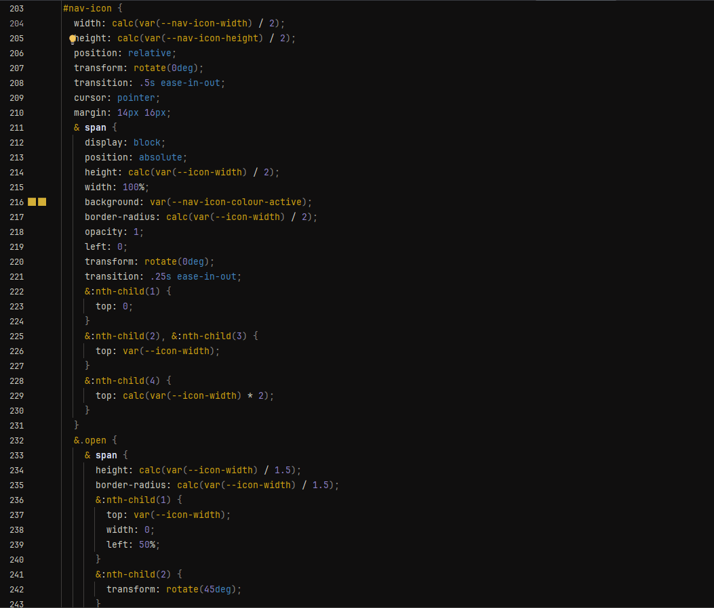
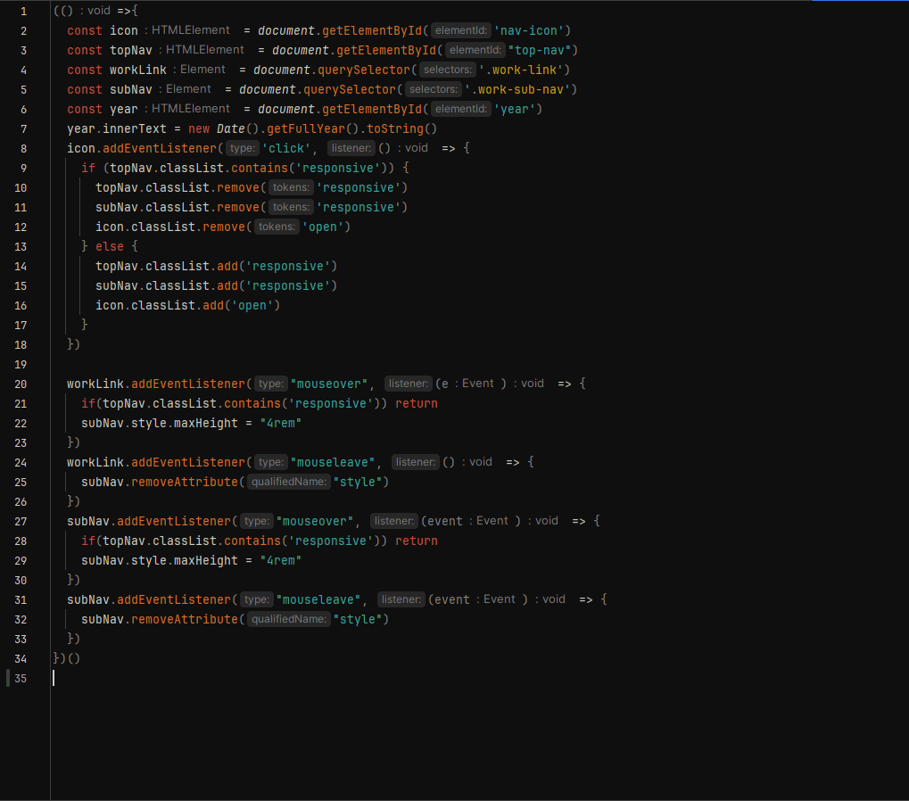
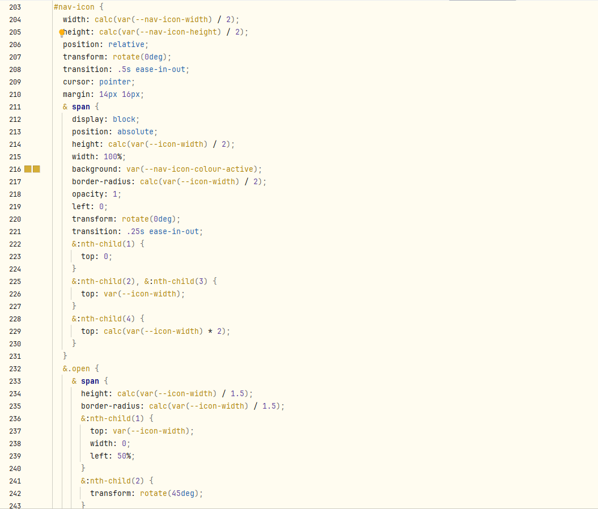
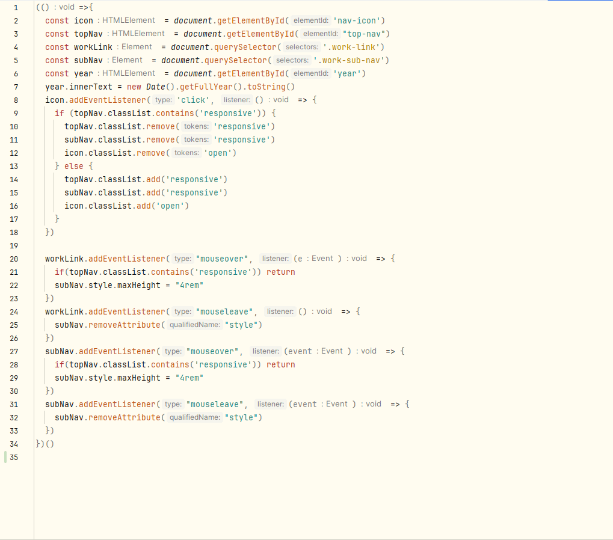

## Flexoki-Dark-color-theme

## Flexoki-Light-color-theme

## How to install:

Taken from https://www.jetbrains.com/help/webstorm/configuring-colors-and-fonts.html#import-color-scheme

1. Press `Ctl` `Alt` `S` to open the IDE settings and then select **Editor | Color Scheme**.
2. From the #Scheme# list, select a color scheme, then click the cog icon, the click **Import Scheme**.

