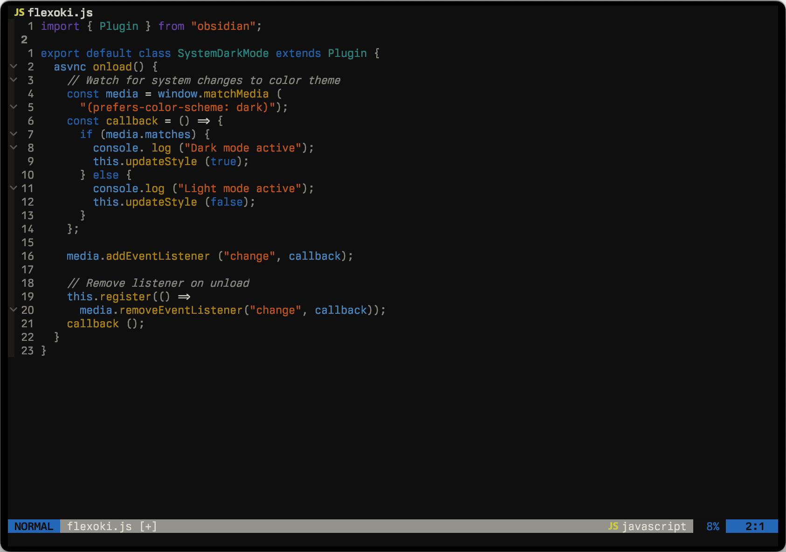
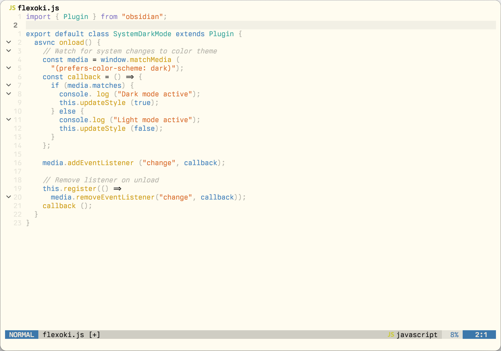

# flexoki-nvim
A nvim adaptation of flexoki by Steph Ango (stephango.com/flexoki)






## Installation
To install simply add via your plugin manager and call the theme

**[Paq](https://github.com/savq/paq-nvim)**

```lua
require('paq')({
  { 'stevedylandev/flexoki-nvim', as = 'flexoki' }
})
```

**[lazy.nvim](https://github.com/folke/lazy.nvim)**

```lua
require("lazy").setup({
  { 'stevedylandev/flexoki-nvim', name = 'flexoki' }
})
```

**[packer.nvim](https://github.com/wbthomason/packer.nvim)**

```lua
require('packer').startup(function(use)
  use({ 'stevedylandev/flexoki-nvim', as = 'flexoki' })
end)
```

## Usage

* Dark

```lua
-- Set colorscheme after options
vim.cmd('colorscheme flexoki')
```

* Light

```lua
-- Set colorscheme after options
vim.cmd('colorscheme flexoki-light')
```

## Building and Contributing

To edit this scheme or contribute download [colorgen-nvim](https://github.com/LunarVim/colorgen-nvim) and edit the `template.toml` file in this repo. Then run `colorgen-nvim template.toml` to generate the updated colorscheme.
