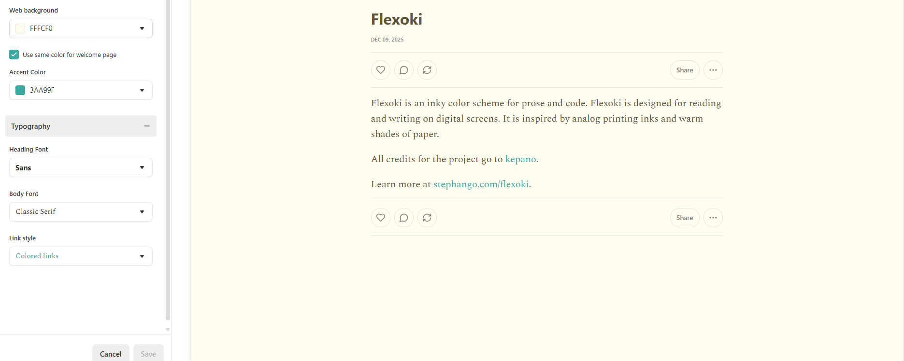
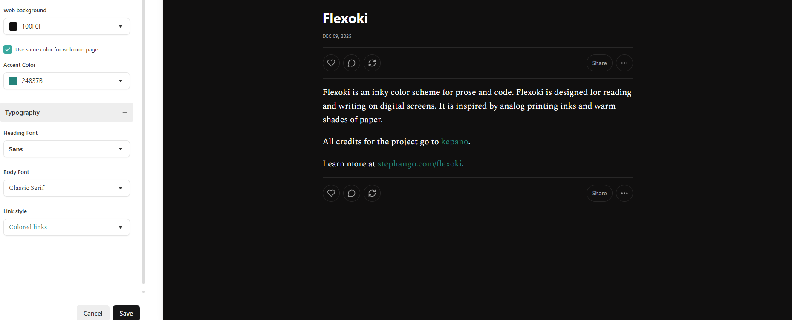

# Flexoki for substack app
Simple grafic configuration for substack using flexoki palette.

Flexoki is an inky color scheme for prose and code. Flexoki is designed for reading and writing on digital screens. It is inspired by analog printing inks and warm shades of paper.

All credits for the project go to [kepano](https://github.com/kepano).

Learn more at [stephango.com/flexoki](https://stephango.com/flexoki).

## How to configure

- Select settings
- Search "Website" Section
- Select for "Publication theme" the option "Custom Theme"
- Click "Go to website theme editor" button
- In "Branding" section, go to colours option

### Light Version

- For web background, insert "FFFCF0"
- For accent colour, insert "3AA99F"

### Dark Version

- For web background, insert "100F0F"
- For accent colour, insert "24837B"

