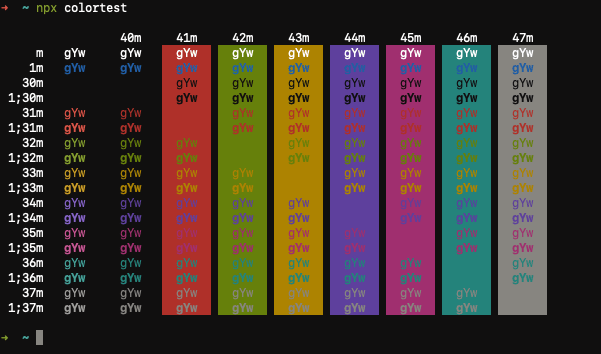
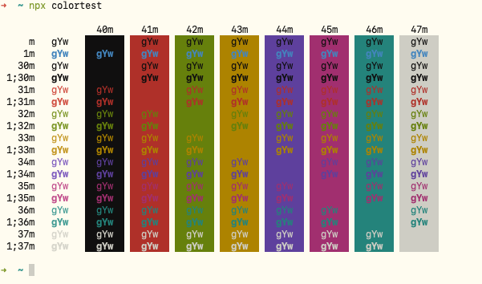

## Flexoki Dark

## Flexoki Light

## Installation

### From Finder

1. Download the terminal file
2. Right-click the downloaded file and click "Open". macOS will warn you with the following message if you double-click the download file
    > "{Filename}" cannot be opened because it is from an unidentified developer.
3. Click "Open" from the popup

### From Terminal

1. Download the terminal file
2. Open Terminal.app
3. Open Settings from the menu bar or by pressing <kbd>⌘ Command</kbd> + <kbd>,</kbd>
4. Click "Profiles"
5. Click the circle with three dots from the bottom of list
6. Click "Import..."
7. Select the downloaded file
