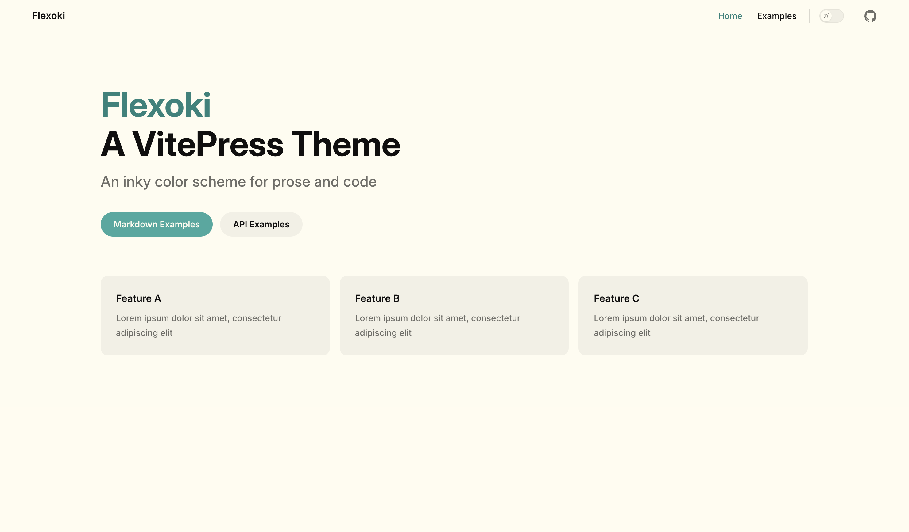
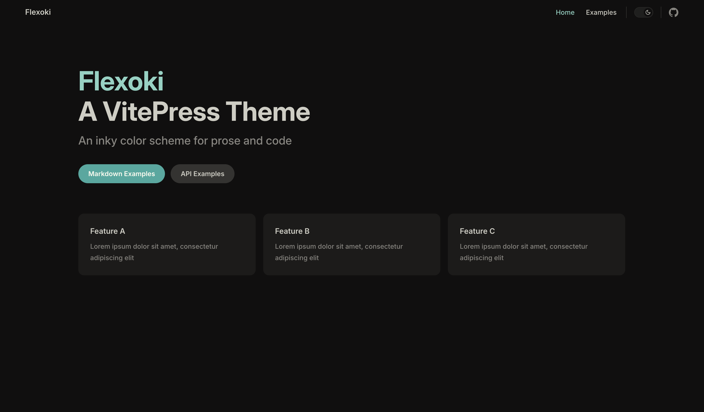

# [Flexoki](https://stephango.com/flexoki) for [VitePress](https://github.com/vuejs/vitepress)

- [Demo site](https://flexoki.netlify.app)
- [GitHub link](https://github.com/mancuoj/vitepress-theme-flexoki)

## Usage

1. `npm install vitepress-theme-flexoki`
2. Then add the theme css to vitepress theme config file:

```ts
// .vitepress/theme/index.ts
import DefaultTheme from 'vitepress/theme'
import 'vitepress-theme-flexoki/index.css'

export default DefaultTheme
```

Instead of installing the package, you can also manually place the [index.css](./index.css) file in your theme folder.

## Previews




