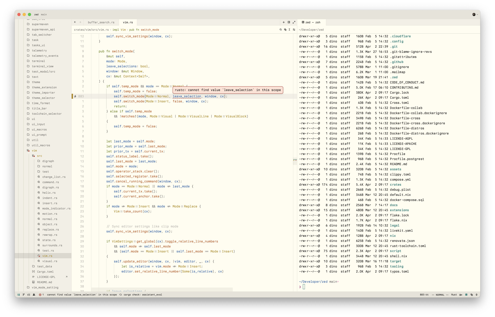

# Flexoki - Zed

Flexoki theme for the [Zed](https://zed.dev/) editor.

For information on how to install the theme, please refer to [Zed - Installing
Extensions](https://zed.dev/docs/extensions/installing-extensions).

## Flexoki Dark

## Flexoki Light

